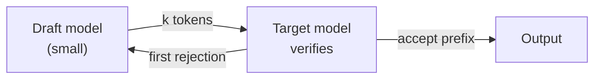

This post is the reference for how the blog works, and it doubles as a live test:
everything below is rendering right now the same way it will in your own posts.
Delete it (`blog/posts/writing-posts-on-this-site.md` plus its entry in
`blog/posts.json`) once it has served its purpose.

## Adding a post

Two steps, no build.

1. Write `blog/posts/<slug>.md`. The file is plain Markdown — no front matter needed.
2. Add an entry at the top of the `posts` array in `blog/posts.json`:

```json
{
  "slug": "why-block-diffusion-drafts",
  "title": "Why block-diffusion drafting works",
  "date": "2026-08-04",
  "tags": ["AI", "Math"],
  "summary": "One paragraph that shows up under the title on the blog index.",
  "image": "img/draft-tree.svg",
  "draft": false
}
```

Then commit and push. The listing sorts by `date` on its own, so the order of the
array does not matter. Tags become filter chips automatically — a tag you invent
here shows up on the index without touching any other file.

`image` is the panel beside the post on the index — usually the post's own key
figure, pointed at the same file the post embeds. It sits in a 16:9 box with the
whole image fitted inside, so plots are never cropped. Omit it and the post gets a
plain tinted panel labelled with its first tag.

Set `"draft": true` to keep something out of the listing while you work on it. The
post is still reachable at its direct URL, so you can preview it and send the link
around before it goes public.

## Text, links, and lists

The usual Markdown: **bold**, *italic*, `inline code`, [links](https://osi.kaist.ac.kr/),
and footnote-ish asides in blockquotes.

> External links open in a new tab automatically. Internal ones don't.

- Bullet lists work
- as do numbered lists
- and nested items:
  - like this one

## Math

Inline math sits between single dollars — $\bar\alpha_t$, $\mathcal{O}(n \log n)$,
$x_t \in \mathbb{R}^d$ — and display math between double dollars:

$$
q(x_t \mid x_0) = \mathcal{N}\!\left(x_t; \sqrt{\bar\alpha_t}\, x_0,\ (1 - \bar\alpha_t) I\right)
$$

Subscripts are the usual trap: in most Markdown setups `$x_t$ ... $x_0$` gets eaten
by the emphasis rules and comes out italicised instead of typeset. Here the math is
tokenised *before* inline Markdown runs, so `x_t` and `x_0` survive. Write math
normally and don't escape underscores.

Multi-line environments work too:

$$
\begin{aligned}
\mathcal{L}(\theta) &= \mathbb{E}_{t, x_0, \epsilon}\left[\|\epsilon - \epsilon_\theta(x_t, t)\|^2\right] \\
                    &= \mathbb{E}\left[\|\epsilon - \hat\epsilon\|^2\right].
\end{aligned}
$$

## Code

Fenced blocks take a language name and get syntax highlighting plus a copy button
on hover. Dollars and underscores inside code are left alone.

```python
import torch

def acceptance_rate(draft_logits, target_logits, x_t):
    """Expected fraction of drafted tokens the target model keeps."""
    p = torch.softmax(target_logits, dim=-1)
    q = torch.softmax(draft_logits, dim=-1)
    return torch.minimum(p, q).sum(dim=-1).mean()
```

```bash
python3 -m http.server 8000    # preview the site locally
```

## Tables

Pipe tables, with `---:` for right alignment. Numbers get tabular figures so columns
line up. Wide tables scroll on their own instead of stretching the page.

| Setting | Tokens/s | Speedup | Accepted |
| ------- | -------: | ------: | -------: |
| Autoregressive baseline | 42.1 | 1.00× | — |
| Speculative, depth 2 | 78.4 | 1.86× | 71% |
| Speculative, depth 4 | 118.7 | **2.82×** | 58% |
| Speculative, depth 8 | 121.3 | 2.88× | 34% |

### Grouped columns

Two columns measuring the same thing want one label above them both. Leave the
header cell after a label empty and it merges into the label; then start a body row
with an empty cell and that row is lifted into the header as the sub-labels.

| Model | Latency |  | Quality |  | **Overall** |  |
| :---- | :---: | :---: | :---: | :---: | :---: | :---: |
|  | ms | tok/s | avg@8 | pass@8 | avg@8 | pass@8 |
| Baseline | 24.1 | 42.1 | 46.2 | **70.8** | 24.9 | **44.5** |
| Ours | **18.6** | **78.4** | **49.2** | 70.2 | **26.1** | 43.0 |

That is written as:

```markdown
| Model | Latency |  | Quality |  | **Overall** |  |
| :---- | :---: | :---: | :---: | :---: | :---: | :---: |
|  | ms | tok/s | avg@8 | pass@8 | avg@8 | pass@8 |
| Baseline | 24.1 | 42.1 | 46.2 | **70.8** | 24.9 | **44.5** |
```

Each group takes a colour, which tints its columns and any **bold** value inside
them. Bold marks the better of the values being compared, and the weight carries
that signal on its own for anyone who cannot see the hue. A group whose label is
itself bold — `**Overall**` above — is read as a summary and stays neutral rather
than taking a colour of its own.

Groups double the column count, so give the labels short names and let the box
scroll if it must.

## Figures

An image on its own line becomes a figure. An *italic* line right after it becomes
the caption, and clicking the image opens it full-size in the same lightbox the
publications page uses.


*A placeholder figure. For real plots, export from matplotlib with
`plt.savefig("blog/img/name.svg")` — SVG stays sharp at any zoom.*

The markup for that is just:

```markdown


*A placeholder figure.*
```

Paths are relative to the `blog/` folder, so `img/…` points at `blog/img/…`.

## Diagrams

A `mermaid` fence renders as a diagram — no image file to manage, and it follows
the light/dark theme when you flip it.



Flowcharts, sequence diagrams, state machines, and Gantt charts all work. See the
[Mermaid docs](https://mermaid.js.org/) for the syntax.

## What renders where

| You write | You get |
| --------- | ------- |
| `$…$` / `$$…$$` | KaTeX math |
| ` ```python ` | highlighted code + copy button |
| ` ```mermaid ` | a themed diagram |
| `` on its own line | a figure, click to zoom |
| `*italic*` line under a figure | its caption |
| a pipe table | a scrollable, aligned table |
| a blank header cell, then a blank leading cell | one label over grouped, colour-coded sub-columns |
| two or more `##` headings | the sticky contents sidebar |

The sidebar on the right appears once a post has three or more headings, and drops
below the title on narrow screens.
